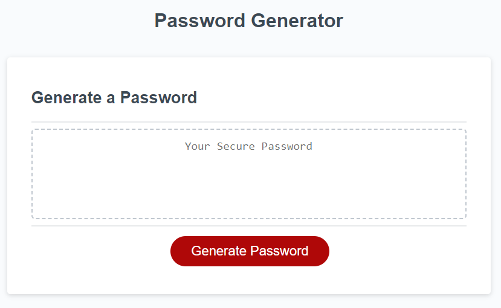

# Random password generator

## Name
Random password generator

## Description
This program generates a random password using Javascript. The user inputs a password length anywhere between 8 and 128 characters, and asks whether they want lowercase, uppercase, numbers, and symbols in their password. The randomized password is then generated in the textbox, which can easily be copied and pasted. To view the project on GitHub Pages, click <a href="https://sifrult.github.io/random-password-generator/" target="_blank">here</a>.

## Visuals
